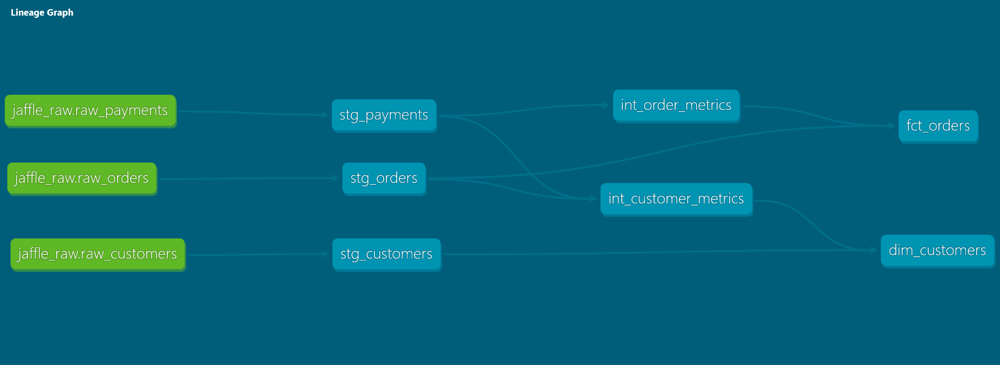

# Analytics Engineering with dbt

## Lineage Graph

The project follows a layered architecture (staging → intermediate → marts) with clear dependency separation.



## How to Run

```bash
# Clone the repository
git clone <repo_url>
cd dbt_analytics_engineering

# Create virtual environment
python -m venv .venv

# Activate the virtual environment

# On Mac/Linux
source .venv/bin/activate  

# On Windows
source .venv\Scripts\activate

# Install dependencies
pip install dbt-duckdb

# Run dbt commands
dbt seed
dbt build
```

### Badge
